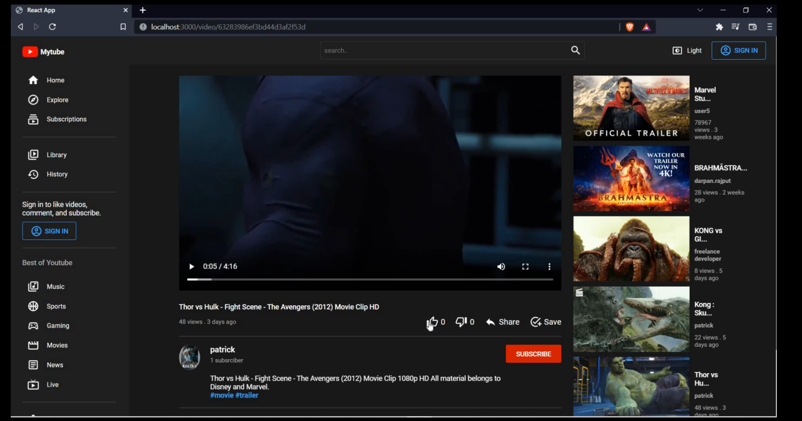
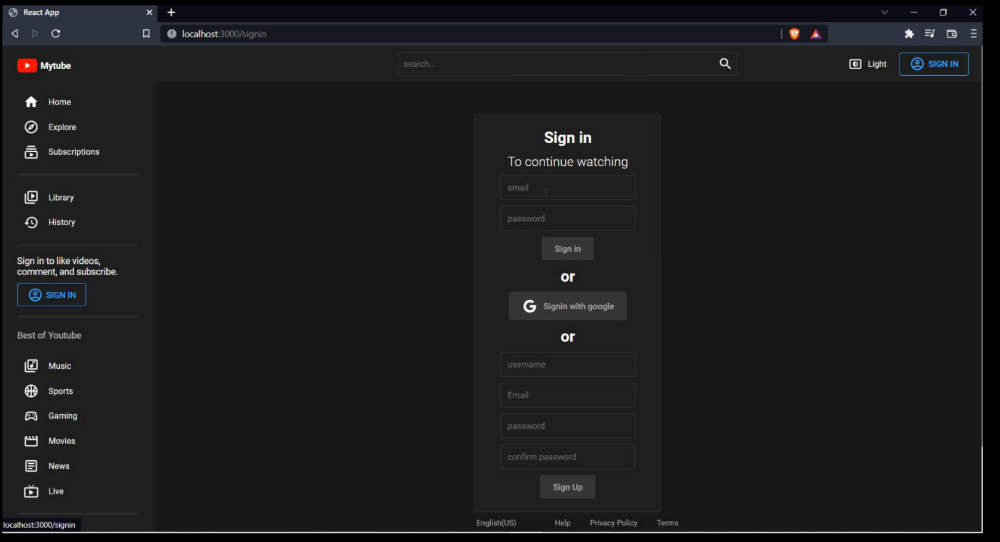
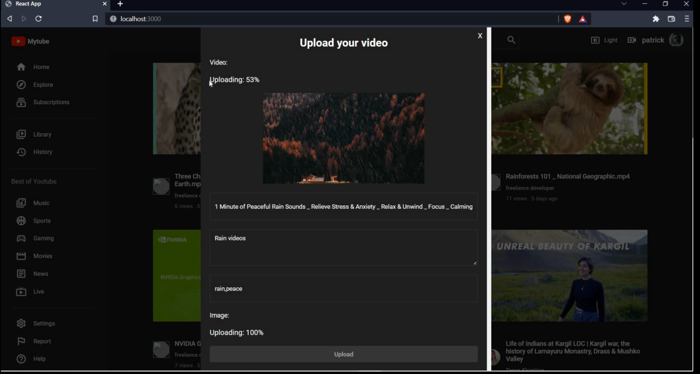
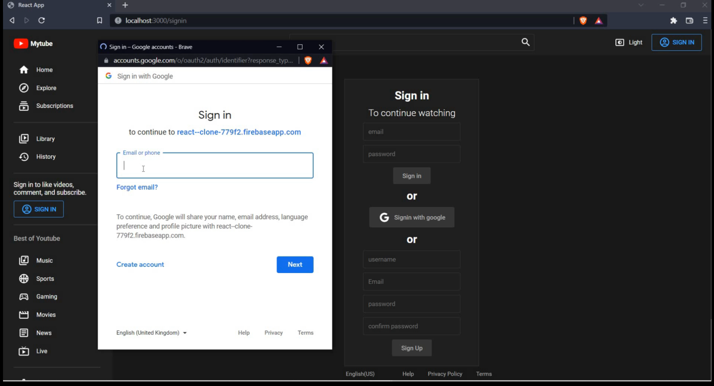
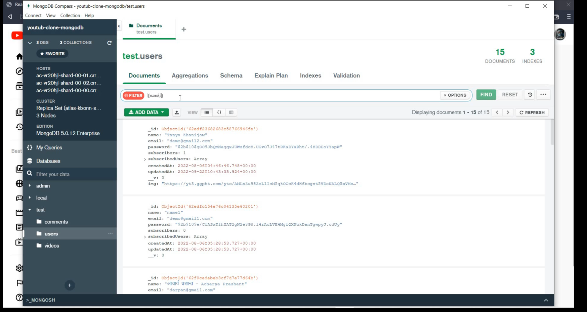

## Youtube Clone Project.
This project is clone of youtube app and is only for learning
purposes. it include only basic funtionality of the youtube app
like signin,video streaming,upload video to firebase,like,dislike a video and subscribe to a channel. for video demo [click here](https://www.instagram.com/p/Ci2JkasDhgt/)

<sub>**Note**:**Avoid cloning the assets folder**</sub>
## Project Screenshots


|  |            |
| :--------------------------------------- | :------------------------------------------ |
|        |  |


## Project Setup Requirement
1. Firebase Account setup-for storing and streaming videos.
2. Mongo DB setup- storing the user's data.
   
## Project setup to run on localhost
1. client will be running on `http://localhost:3000`
2. server will be running on `htp://localhost:8800`
   
To run this project clone this repository
and run `npm install` to install all the node
modules both in client and server folder.

## Run Server Locally
After installing all the node modules create `.env` file in server's root directory and use these variables
`MONGO_URL=your mongo db url`->**use yours**
`PORT=8800`->**use as it is.**
`JWT_KEY=SECRET_JWT_KEY_FOR_AUTH`->**use as it is**
then just use `npm start` to start the server code.

<sub> **Note**: *don't forget to allow connection from any where in mangod db dahshboard. inside the network settings, add the IP list 0.0.0.0/0 to allow connection from everywhere.* </sub>

## Run Client Locally
After installing all the node modules create `.env`,`.env.development` and `.env.production` in the client's root-directory and use these environment variables. want to know more about firebase setup click the link here [setup a firebase project](https://medium.com/nerd-for-tech/setting-up-a-create-react-app-with-firebase-4fb3601fe2d4)

<table>
<tr>
<td>

```js
//inside the .env.development file
REACT_APP_FIREBASE_KEY=your firbase key`
REACT_APP_ENV_NAME=dev`
```
</td>

<td>

```js
//inside the .env.production file
REACT_APP_FIREBASE_KEY=your firbase key`
REACT_APP_ENV_NAME=prod`
```
</td>

<td>

```js
//inside the .env file
REACT_APP_FIREBASE_KEY=your firbase key`
REACT_APP_ENV_NAME=dev`
```
</td>
</tr>
</table>

to run the client navigate to the project client directory and run the command `npm start` it will start your client's code at port `3000`. at first you won't see any videos because there is no video stored at firebase so i would recommend you to first import the users collection then login into any of them using their email and password
*(password is `password`for all users)* and then upload videos using upload button.make sure to fill all the fields before you click upload.

## Postman API
you can directly import all the api calls in postman
from here [postman api](assets/Youtube%20Clone.postman_collection.json).

## Mongo DB users Collections
you can also import all the users directly into mongodb database from here -[users](assets/users.json).*(password is `password`for all users)*. once it is imported you can directly upload videos using credential of any user.

